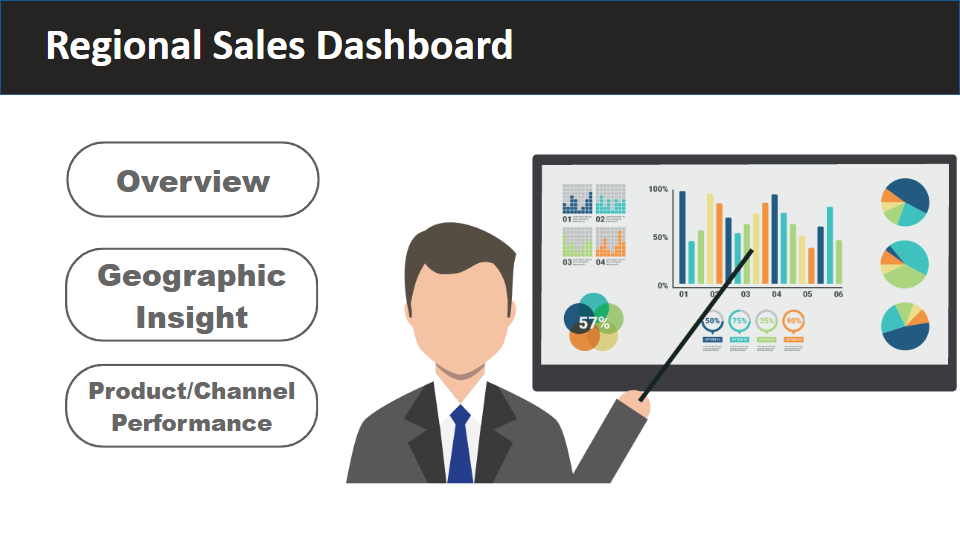
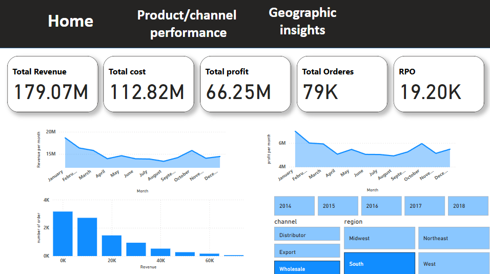
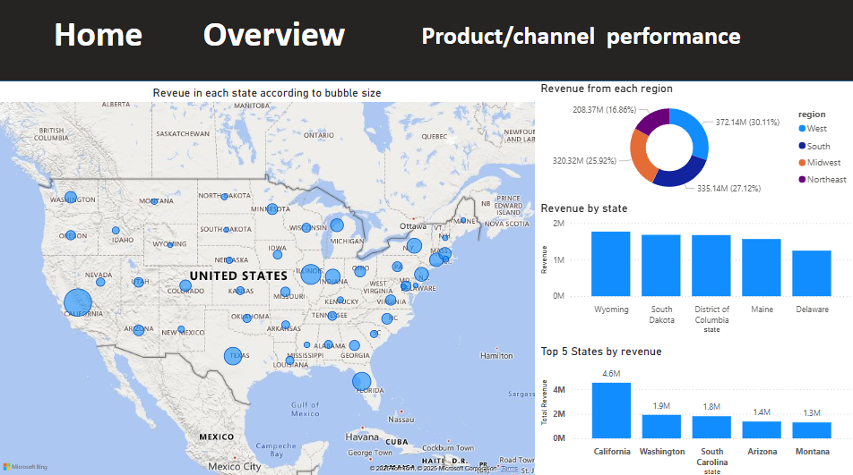
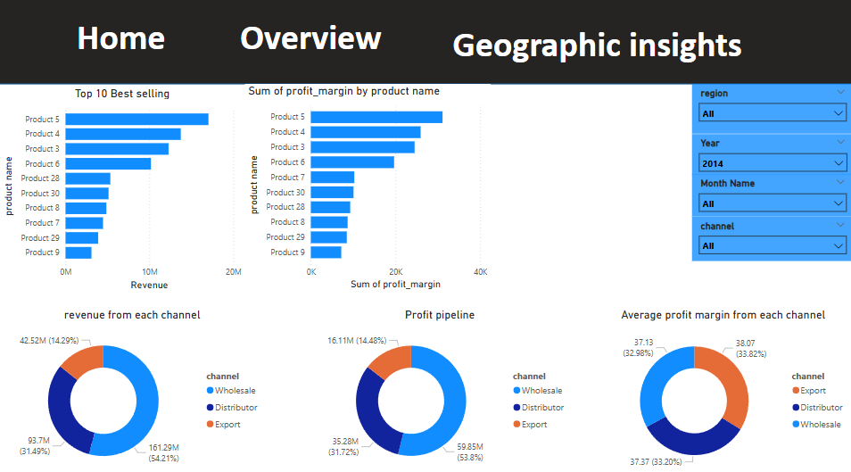

# Regional Sales Power BI Dashboard

This Power BI dashboard provides deep insights into regional sales performance, product/channel analysis, and geographic sales distribution. Below is a page-by-page breakdown with key features and visualizations.

---

## 1. Home (Landing Page)

The Home page introduces the **Regional Sales Dashboard** and provides easy navigation to three core analysis areas:
- **Overview**
- **Geographic Insight**
- **Product/Channel Performance**

This landing page helps users quickly access the section most relevant to their analysis needs.

---

## 2. Overview

The Overview page presents high-level KPIs and overall business performance metrics, including:
- **Total Revenue**: 179.07M
- **Total Cost**: 112.82M
- **Total Profit**: 66.25M
- **Total Orders**: 79K
- **RPO (Revenue per Order)**: 19.20K

Visualizations include:
- Monthly trend charts for both revenue and profit
- Distribution of orders by revenue brackets
- Interactive filters for year, channel, and region to drill down data

---

## 3. Geographic Insights

This page focuses on sales performance across different states and regions:
- **Map Visualization**: Bubble size shows total revenue per state
- **Revenue by Region**: Donut chart segments sales by region (West, South, Midwest, Northeast)
- **Revenue by State**: Bar chart for top states
- **Top 5 States by Revenue**: Highlight of leading states (e.g., California, Washington, South Carolina)

These visuals enable users to spot geographic sales trends and identify high/low performing areas.

---

## 4. Product/Channel Performance

This page provides a detailed view of sales and profitability by product and channel:
- **Top 10 Best Selling Products**: Ranked by revenue
- **Profit Margin by Product**: Top products with highest margins
- **Revenue by Channel**: Donut chart for Wholesale, Distributor, Export
- **Profit Pipeline**: Channel-wise profit distribution
- **Average Profit Margin by Channel**: Comparative analysis of channel profitability
- **Filter Panel**: Slicers for region, year, month, and channel to customize the view

This section is ideal for understanding which products and channels drive the most value.

