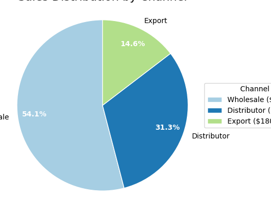

# 📊 Sales Revenue Analysis Using Python

This project presents an in-depth sales analysis performed using Python. Various visualizations and insights were generated to support data-driven business decisions regarding product performance, customer contribution, regional success, and monthly trends.

---

## 📁 Project Overview

The main objectives of this analysis were to:
- Identify top and bottom performing **products**, **customers**, and **regions**.
- Track **monthly sales trends** and **year-over-year performance**.
- Understand **channel-wise revenue contributions**.
- Highlight key areas for **improvement** or **strategic investment**.

---

## 📌 Visual Analysis Summary

### 1. **Top 10 Products by Revenue**
- Helps identify best-selling products.
- Useful for prioritizing marketing and inventory efforts.

---

### 2. **Bottom 10 Products by Revenue**
- Flags products that may need improvement, rebranding, or discontinuation.

---

### 3. **Top and Bottom 10 Customers by Revenue**
- Enables sales targeting for retention and customer development.
- High-value customers should be prioritized for engagement.

---

### 4. **Top and Bottom 10 States by Revenue**
- Regional performance analysis for optimizing distribution and sales strategy.

---

### 5. **Monthly Sales Trend (Excl. Jan/Feb 2018)**
- Tracks monthly sales fluctuations to understand seasonal patterns.

---

### 6. **Sales Distribution by Channel**
- Shows proportion of revenue from Wholesale, Distributor, and Export channels.

---

### 7. **Year-over-Year Sales & Profit Analysis**
- Compares sales, profit, and order volume across years.

---

## 🛠️ Tools & Technologies Used

- **Python (Pandas, Matplotlib, Seaborn)**
- **VS Code**
- **Data Cleaning & Aggregation**
- **Revenue Analysis & Visualization**

---

## 📈 Insights & Recommendations

- Products with consistently low revenue need **performance review**.
- Retain and strengthen relationships with **top customers**.
- Explore growth opportunities in **underperforming regions**.
- Maintain balance across **sales channels** for sustainable growth.